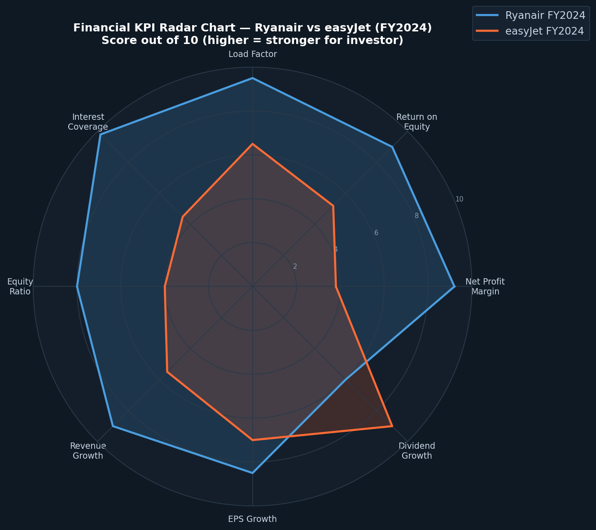
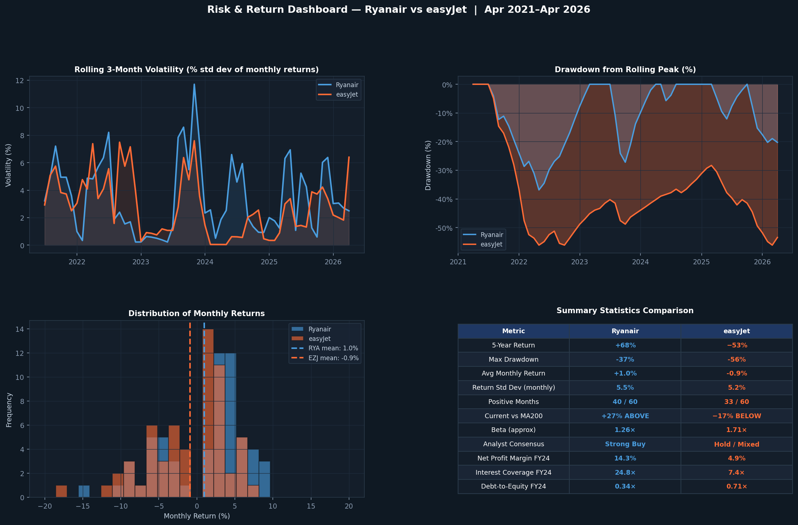

# Ryanair vs easyJet Investment Analysis

Python visualisation suite for a Woods PLC investment case comparing Ryanair (RYA) and easyJet (EZJ).

**Script:** `airline_analysis_full_code.py` (pandas, numpy, matplotlib)

**Charts produced**

| # | Chart |
|---|-------|
| 01–02 | Share price annotated with news events (each airline) |
| 03–04 | Monthly returns heatmaps |
| 05 | Cumulative returns comparison |
| 06 | FY2024 financial KPI radar — net margin, ROE, load factor, interest cover, equity ratio, revenue / EPS / dividend growth |
| 07 | Volatility, correlation & drawdown dashboard |
| 09 | 50-day vs 200-day moving-average crossover |
| 10 | Bollinger bands |

